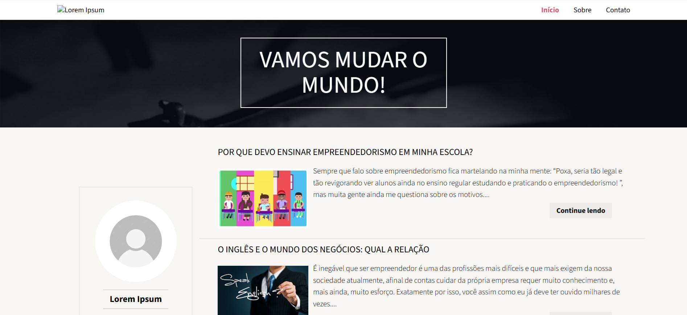

# Blog Vamos Mudar o Mundo 




> Projeto de um blog, desenvolvido em React com recursos de React-Router-DOM e artigos buscados em Fake API

<br>

## 📋 Pré-requisitos

[NodeJS](https://nodejs.org/pt) - Ambiente de execução JavaScript no lado do servidor, que permite criar aplicações rápidas e escaláveis

<br>

## 🛠️ Construído com
* [React](https://pt-br.react.dev/) - Biblioteca JavaScript para construção de interfaces de usuário interativas e dinâmicas;
* [Sass](https://sass-lang.com/) - Extensão do CSS que adiciona funcionalidades, facilitando o desenvolvimento de estilos mais organizados e reutilizáveis;
* [Context API](https://pt-br.legacy.reactjs.org/docs/context.html#api) - Ferramenta que permite compartilhar dados entre componentes de forma global;
* [React-Router-DOM](https://reactrouter.com/) - Biblioteca que permite navegação entre diferentes páginas ou componentes em aplicações React, gerenciando rotas de forma dinâmica;
* [Fetch API](https://developer.mozilla.org/en-US/docs/Web/API/Fetch_API) - Interface JavaScript que permite realizar requisições HTTP assíncronas para obter ou enviar dados de/para um servidor;
* [React Icons](https://react-icons.github.io/react-icons/) - Biblioteca que oferece ícones personalizáveis para projetos em React, facilitando a integração de ícones vetoriais.
<br>


## ⚙️ Executando o projeto

```
git clone https://github.com/maxsueldev/blog-vmm-react.git
```

* Abra a raiz do projeto e execute: 

```
npm install
```

* E em seguida: 

```
npm run dev
```

<br>

## JSON Server API
* https://json-server-max.vercel.app/artigos

